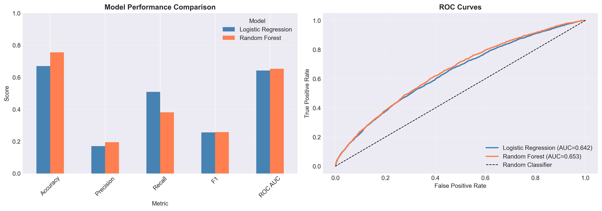
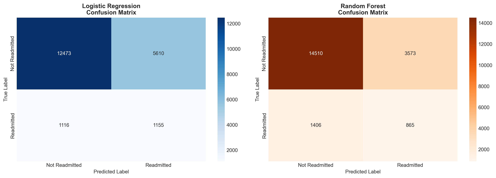
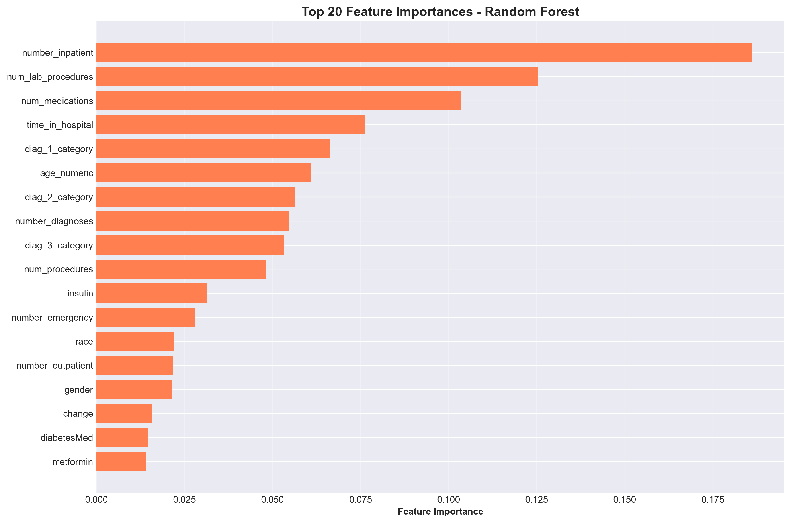

# 🏥 Healthcare Readmission Prediction

🚀 **End-to-End Machine Learning Project to Predict Hospital Readmissions**
📊 Built using real-world healthcare data to identify high-risk patients and improve hospital decision-making.

---

## 📌 Overview

Hospital readmissions are a major challenge in healthcare, leading to increased costs and resource strain.
This project develops a machine learning solution to **predict patient readmission risk**, enabling proactive care and better hospital management.

---

## 🎯 Objectives

* Predict whether a patient will be readmitted
* Handle real-world challenges like **missing data** and **class imbalance**
* Compare multiple models to achieve optimal performance

---

## 📊 Dataset

* Diabetes dataset from 130 US hospitals
* Includes:

  * Patient demographics
  * Diagnoses and procedures
  * Lab results
  * Hospital visit history

---

## ⚙️ Tech Stack

* **Python**
* **Pandas, NumPy** – Data processing
* **Matplotlib, Seaborn** – Visualization
* **Scikit-learn** – Machine Learning

---

## 🔄 Project Workflow

### 1. Data Preprocessing

* Handled missing values (`? → NaN`)
* Removed irrelevant features
* Encoded categorical variables
* Scaled numerical features

### 2. Exploratory Data Analysis (EDA)

* Distribution analysis
* Correlation matrix
* Feature vs readmission insights

### 3. Handling Class Imbalance

* Used `class_weight='balanced'`
* Improved recall for minority class

### 4. Model Building

* Logistic Regression (baseline)
* Random Forest Classifier

### 5. Model Evaluation

* Accuracy
* Precision
* Recall
* F1 Score
* ROC-AUC

---

## 📈 Results

| Model               | Accuracy | Precision | Recall | F1 Score | ROC-AUC |
| ------------------- | -------- | --------- | ------ | -------- | ------- |
| Logistic Regression | ~        | ~         | ~      | ~        | ~       |
| Random Forest       | ~        | ~         | ~      | ~        | ⭐ Best  |

👉 **Random Forest outperformed Logistic Regression**, especially in ROC-AUC and recall.

---

## 📷 Key Visualizations

### 🔹 Model Comparison



### 🔹 Confusion Matrix



### 🔹 Feature Importance



---

## 💡 Key Insights

* Patient history and prior visits strongly influence readmission
* Class imbalance significantly impacts model performance
* Ensemble models (Random Forest) provide better predictive power

---

## 🏥 Business Impact

* Helps hospitals **identify high-risk patients early**
* Enables **proactive treatment planning**
* Reduces **readmission rates and operational costs**

---

## 🚀 How to Run

```bash
git clone https://github.com/vaibhavh14/healthcare-readmission-analysis.git
cd healthcare-readmission-analysis
pip install -r requirements.txt
jupyter notebook
```

---

## 📁 Project Structure

```
healthcare-readmission-analysis/
│
├── data/
├── notebooks/
├── visualizations/
├── README.md
└── requirements.txt
```

---

## 👨‍💻 Author

**Vaibhav Negi**

---

## ⭐ If you found this useful

Give it a ⭐ on GitHub and feel free to connect!
